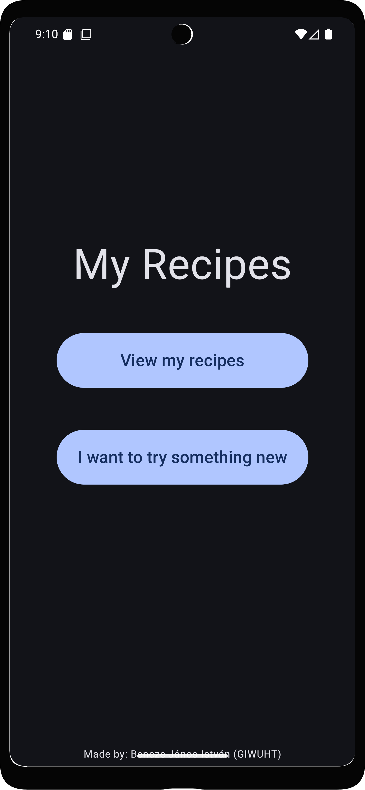
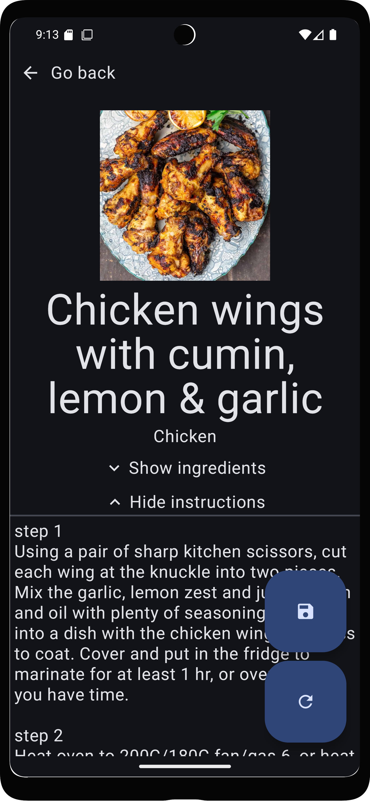
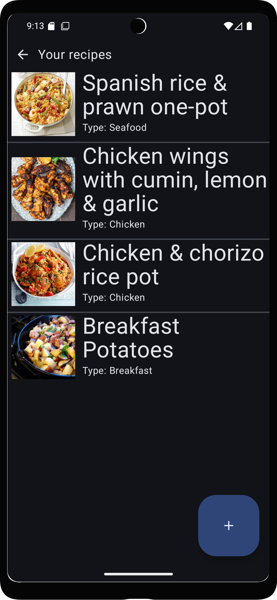
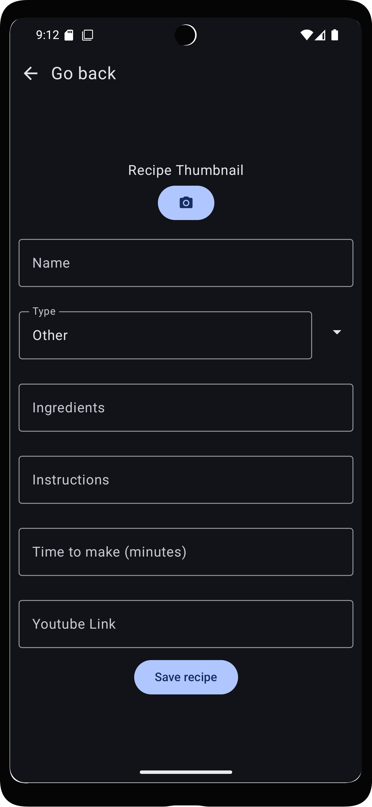
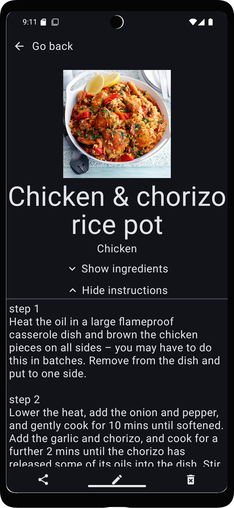
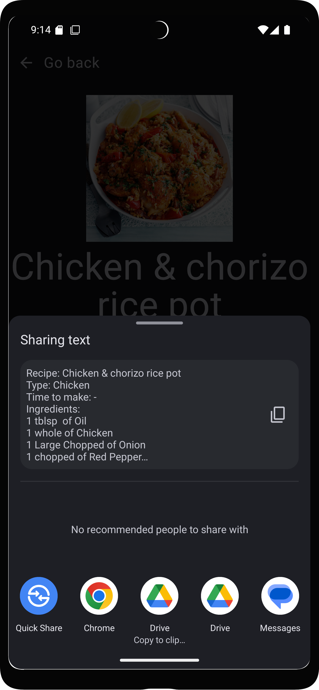
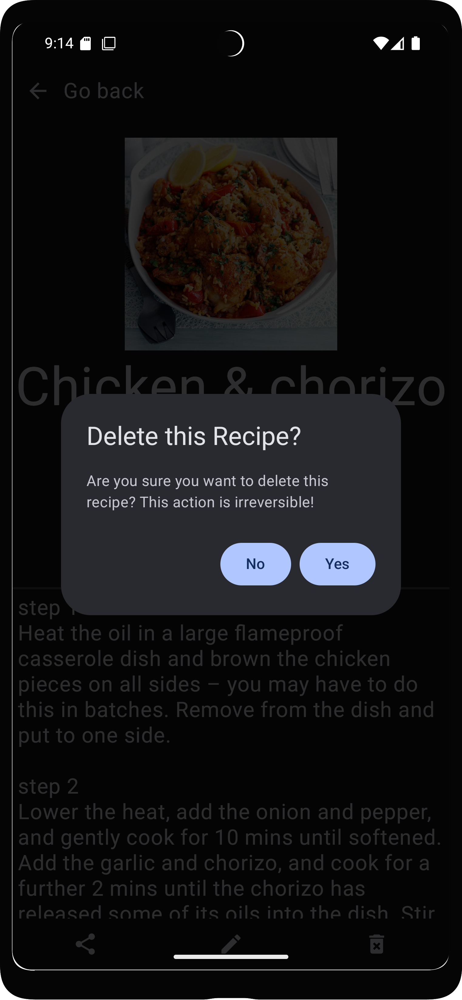
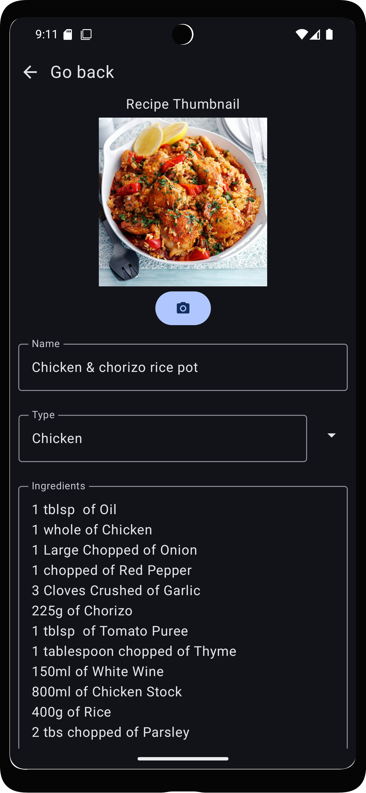
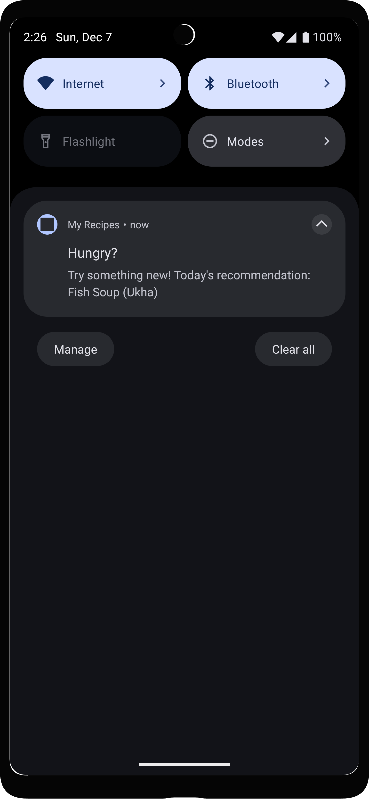

<h1>MyRecipes: Recept tároló és ajánló alkalmazás projekt</h1>
<h2>Androidalapú Szoftverfejlesztés Nagyházi</h2>

Használt tehnológiák:
-Kotlin
-TheMealDB API

note: This is a reupload of the original, private repository, with most Uni-related stuff removed

# Házi feladat specifikáció

## Androidalapú szoftverfejlesztés
### 2025-11-09
### Bencze János István

## Bemutatás

Az alkalmazásom egy recept-könyv applikáció, aminek 2 fő feladata van: Saját receptek megírása és elmentése (illetve 6. laboron bemutatott módon, megosztása is), illetve új receptek találása/ajánlása.
 
## Főbb funkciók

1. Főoldal: ki lehet választani hogy a meglévő receptjeink listáját akarjuk megnézni, vagy új receptet szeretnénk kapni

2. Meglévő receptek listája: Receptek hozzáadása, szerkeztése, megnézése és megosztása - olyan módon mint a todoList-es labor(ok)on volt: LazyColumn címmel és hogy mennyi idő elkésziteni, ha adunk meg; klikkre details és megosztás. 

3. Details ablak a receptekről, ahol meg lehet nézni ezek jellemzőit: Receptekről eltároljuk a nevét, a hozzávalóit, milyen hosszú időbe telik és hogyan kell elkészíteni, stb.

4. Új receptek felfedezése: API-n keresztül lekérünk egy random receptet, és ezt megmutatjuk; gomb új recept kérésére illetve aktuálisan mutatott recept elmentésére.

## Választott technológiák:

- Hálózatkezelés: Az alkalmazás a [https://www.themealdb.com/api.php](https://www.themealdb.com/api.php) nyílt API-t használja, és REST végponton keresztül tölti le az ételrecepteket.

- Adatbáziskezelés: A felhasználó elmentheti az általa írt, illetve az API-n keresztül kapott recepteket

- Notificationök: Be lehet állitani hogy az alkalmazás küldjön értesitéseket délután/estefelé, ételajánlásokról.

- Intent/megosztás: Mint 6. laboron, meg lehet osztani a receptet szöveges formában

___

# Házi feladat dokumentáció

### My Recipes

A kép flaticon.com oldalról származik. Készitője: justicon

## Bemutatás

Ez az alkalmazás receptek tárolására és felfedezésére hasznos. Az alkalmazásra az ötlet nagyon egyszerű okból született, ugyanis rájöttem hogy egy egyszerű palacsinta receptet sem tudok megjegyezni, így hasznos lehet leírni valahová, és így a célközönség is, magamfajta emberek.

## Főbb funkciók

Ennek az alkalmazásnak 2 fő funkciója van: receptek eltárolása, és új receptek felfedezése. 
Új, véletlenszerű recepteket egy online adatbázisból kér le, amelyeket el tudunk menteni a sajátjaink közé. Ezen kívül kézzel is tudunk megadni recepteket

A receptek a következő tulajdonságokkal rendelkezhetnek:

	-Név
	-Típus
	-Hozzávalók
	-Útmutatás
	-Mennyi idő elkészíteni
	-Youtube (de igazából bármilyen) link.
	-Kép

Ezen a 2 fő funkción kívűl rendelkezik egy mellékfunkcióval, ami mégpedig az, hogy minden nap 6 órakkor értesítést küld, ami egy ételajánló. Erre kattintva megnyílik az alkalmazás, az ételajánlás ablakban, betöltve az ajánlott receptet. Innen a felhasználó tudja irányitani, mintha ő navigált volna be erre a képernyőre.

## Felhasználói kézikönyv

### Főmenü

1. ábra: Alkalmazásba belépéskor a főmenü fogat

A főmenü 2 gombból áll: Az első (View my recipes) megnyitja az elmentett receptek listáját. A második (I want to try something new) egy random receptet fog ajánlani.

### Random recept ajánló

2. ábra: Random recept ajánló ablak

Ha a főmenüben az "I want to try something new" gombra nyomunk, ez az ablak fog előjönni. Itt egy recept vár minket. Ha tetszik a recept és meg akarjuk tartani, akkor el tudjuk menteni. Erre a jobb alsó sarokban a mentés gomb (egy Floppy Disk) szolgál. Ugyancsak itt van egy másik gomb, amivel egy másik receptet tudunk kérni.

Ha a receptet elmentjük, akkor vissza fogunk kerülni a főmenübe.

### Meglévő receptek listája

3. ábra: Receptek listája nézet

Ha a főmenüben az "View my recipes" gombra nyomunk, ez az ablak fog előjönni. Itt a lementett receptjeink listája fogad. Tevékenységeket nézve itt is kettő lehetőségünk van: rákattinthatunk az egyik receptre, ami meg fogja ezt nyitni, vagy felvehetünk egy új receptet, a jobb alsó gombbal (egy plusz a jele).

### Új recept felvétele

4. ábra: Új recept felvétele nézet

Ha a receptek listájában új listát veszünk fel, akkor ez a nézet fog fogadni. Ez az ablak 5 beviteli mezőből, egy dropdown menüből, és egy mentés gombból áll.
A sorrend és funkcionalitás a következő:

	1. Recept képe - gomb kép készitésére
	2. Recept neve - beviteli mező
	3. Recept/étel típusa - dropdown menü
	4. Hozzávalók - beviteli mező
	5. Elkészités lépései - beviteli mező
	6. Time to make (mennyi időbe telik elkésziteni) - beviteli mező (nem kötelező)
	7. Youtube Link - beviteli mező (akármilyen linket meg lehet adni, nem muszály youtube legyen; nem kötelező)
	8. Recept elmentése - gomb

Ha a receptet elmentjük, akkor vissza fogunk kerülni a listák nézetébe, és az új receptünk már elérhető is lesz.

A receptet csak akkor tudjuk elmenteni, ha van megadva név, hozzávalók és instructions. Type alapból Other, így az megadva indul, míg a time to make-t és a linket nem kötelező megadni. 

Ha adunk meg time to make-et, akkor az egy szám kell legyen, ami után automatikusan odakerül hogy perc. 

Ha adunk meg linket, az alkalmazás automatikus megnyithatóvá teszi: (ha van "http://" vagy "https://" előtag, ezeket levágja, majd) hozzárakja az elejére hogy "https://"

### Recept megnyitása

5. ábra: Recept ablak

Ha a receptek listájában rákattintunk egy receptre, ez az ablak fog előjönni.
Ez tartalmaz minden lényegi információt egy receptről:

	-Képét
	-Nevét
	-Típusát
	-Hozzávalóit
	-Elkészités lépéseit
	-Linket (ha van)

A képernyő alján 3 gombbal találkozhatunk, ezek sorban a következőket tudják:

	1.Recept megosztása: Erre a gombra kattintva felugrik egy ablak, ahol ki lehet választani hogy melyik applikációban és milyen szöveggel akarjuk megosztani receptünket

	2.Recept szerkesztése: Erre a gombra előjön a receptszerkesztő felület (lásd következő pont)

	3.Recept törlése: Erre a gombra kattintva felugrik egy figyelmeztető, majd ezt elfogadva kitörlődik a recept, és visszakerülünk a receptek listájára

6. és 7. ábra: Recept megosztó és törlő ablakok

### Meglévő recept szerkesztése

8. ábra: Recept szerkesztése ablak

Ha egy meglévő recepten rányomtunk a szerkesztés gombra, ez az ablak fog várni.
Ez megegyezik az új recept felvétele ablakkal, egyetlen külömbség hogy a mezőkben benne vannak a már meglévő recept tulajdonságai. Bővebb leirást a szerkesztő ablakról az "Új recept felvétele" pontban keress

### Recept ajánló értesítés

9. ábra: Értesítés

Minden nap este 6 órakkor az alkalmazás küld egy recept ajánló értesítést. Erre az értesítésre kattintva meg fog nyílni az ajánlott recept a Random recept ablakban. Innentől kezdve az alkalmazás pontosan ugyanúgy fog működni, mintha a felhasználó navigált volna ebbe az ablakba.

## Felhasznált technológiák:

- [TheMealDB](https://www.themealdb.com) online adatbázis **API**-t használtam random receptek kérésére
- **Room** alapú adattárolás
- **Intent** használata **megosztáshoz**
- **Worker** használata notification elküldéséhez
- **Pending intent** használata hogy a notification el tudja indítani az appot
- **Alarm Manager** használata, hogy tudjuk mikor kell küldeni a notification-t
- **Broadcast Receiver** használata, hogy észrevegyük az Alarm Manager riasztását
- **JsonClass** hogy fel tudjuk dolgozni az API által küldött Json-t
- **Engedélyek** kezelése és kérése, pl internet eléréshez, ExactAlarmhoz és értesités küldéséhez

## Fontosabb technológiai megoldások

A legnehezebb messze a notification megoldása volt (főleg hogy az utolsó 3 napban jutott eszembe hogy ilyet is akartam). Megpróbáltam dependency injection-nel és hilt-el, de ez a megoldás nem sikerült, szóval idő hiányában maradnom kellet ezek nélkül. Ezen kívül nemtudom mennyire helyes megközelités, de le kellet példányositanom a moshi-t, a retrofitet, a repository-t, és a callRandomRecipe use-case-t is a workeren belül, hogy el tudja késziteni a random receptet, amit a notification ajánlani akar. Ezen kívül módosítanom kellet a navigation-t és a MainActivity-t is, hogy le tudjam kezelni a recept betöltését alkalmazás inditásakor. Ezt úgy oldottam meg, hogy amikor a notificationre kattint a felhasználó, elindít egy pending intent-et ami megnyitja az applikációt. Ehhez az intenthez hozzáadtam extra-ként a lekért receptnek a tulajdonságait, amit aztán a mainActivity érzékel, ez alapján létrehoz egy receptet, és ezt adja a Navigationnek (Ha az activity nem kap extrákat - tehát nem a notif.ból indult az app, null-t fog átadni). Ha a Navigation null-t kapott, akkor a Main Menüt fogja betölteni, ha pedig egy receptet, akkor a RandomRecipeScreen-t, ezzel a kapott receptel.
